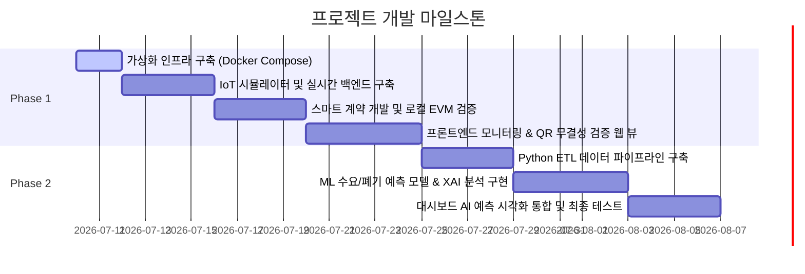

# Development Roadmap: ML Demand Analyzer & Cold Chain Ledger

본 프로젝트는 참치의 초저온 유통 온도 모니터링 및 블록체인 기반의 위·변조 검증 시스템(**Phase 1**)을 구축한 뒤, 수집된 IoT 시계열 데이터와 과거 발주 데이터를 연계하여 AI 기반 수요 및 폐기 리스크를 예측하는 고도화 시스템(**Phase 2**)으로 확장되는 연계형 프로젝트입니다.

---

## 📅 Milestones & Timeline

---

## 🛠️ Step-by-Step Implementation Details

### 🚀 Phase 1: Tuna Cold Chain Ledger (참치 초저온 콜드체인 모니터링)

#### **Step 1: 가상화 인프라 환경 구축 (현재 단계)**
- **목표:** 백엔드, 프론트엔드, AI 파이프라인이 유기적으로 데이터를 공유할 수 있는 격리된 로컬 인프라 환경을 완성합니다.
- **주요 작업:**
  - PostgreSQL, MongoDB, Redis 컨테이너 구성을 담은 `docker-compose.yml` 리팩토링.
  - 데이터 유실 방지를 위한 Docker 볼륨 설정 및 포트 바인딩.
  - 각 어플리케이션 환경 변수(`.env`) 템플릿 완성 및 연결 상태 테스트.

#### **Step 2: IoT 센서 데이터 시뮬레이터 및 실시간 백엔드 파이프라인 구축**
- **목표:** 5초 주기로 참치의 위치(GPS) 및 온도 데이터를 생성하여 프론트엔드로 브로드캐스팅하는 시스템을 만듭니다.
- **주요 작업:**
  - Node.js 기반 IoT 시뮬레이터 스크립트 작성.
  - NestJS 내 WebSocket (Socket.io) 게이트웨이 및 알림 모듈 활성화.
  - 고주기 시계열 로그 적재를 위한 MongoDB 저장 연동.
  - PostgreSQL 기반의 SKU 재고 마스터 CRUD 및 발주(Purchase Order) 결재 워크플로우 비즈니스 로직 작성.

#### **Step 3: 스마트 계약(Smart Contract) 개발 및 블록체인 연동**
- **목표:** 유통 체크포인트 마일스톤 도달 시, 무결성 입증용 해시 값을 로컬 블록체인에 영구 기록합니다.
- **주요 작업:**
  - Solidity를 사용한 `ColdChainTracker.sol` 스마트 계약 개발.
  - Hardhat 로컬 EVM 체인 설정 및 배포 스크립트 작성.
  - NestJS 백엔드 내 Ethers.js를 활용하여 특정 체크포인트 도달 시 스마트 계약 트랜잭션을 트리거하는 로직 연동.

#### **Step 4: 프론트엔드 실시간 시각화 및 QR 무결성 검증 뷰 완성**
- **목표:** 실시간으로 움직이는 운송 경로 지도 및 온도 변화 그래프를 제공하고, 소비자가 QR 코드를 통해 유통 이력 및 무결성을 검증할 수 있는 웹 앱을 완성합니다.
- **주요 작업:**
  - React 대시보드 내 Recharts 기반의 실시간 온도 그래프 구현 (임계치 $-55^\circ\text{C}$ 기준선 표시).
  - 실시간 지도 위치 추적 컴포넌트 탑재.
  - 소비자 모바일 뷰 페이지 제작 및 Ethers.js를 통한 온체인 해시 - DB 해시 매칭 검증 기능 완성.

---

### 🧠 Phase 2: AI 기반 재고·수요 예측 시스템 (고도화)

#### **Step 5: ETL 데이터 파이프라인 구축**
- **목표:** MongoDB의 IoT 시계열 데이터와 PostgreSQL의 주문/재고 이력을 추출하여 ML 피처 마트(Mart) 테이블로 전처리 및 적재합니다.
- **주요 작업:**
  - Python (v3.10) 및 SQLAlchemy를 이용한 데이터 추출(Extract) 파이프라인 구축.
  - 결측치 처리 및 피처 엔지니어링 (온도 이탈률 계산 등 Transform)을 거쳐 `sku_features` 테이블 적재(Load).

#### **Step 6: AI 수요 및 폐기 리스크 예측 엔진 개발**
- **목표:** 머신러닝 알고리즘을 사용해 향후 품목별 수요와 보관 온도 이탈 빈도에 근거한 폐기 위험도를 사전 계산합니다.
- **주요 작업:**
  - XGBoost 및 LightGBM을 활용하여 7일, 14일, 30일 기준 품목별 수요 예측 모델 학습.
  - 온도 임계치 이탈 누적 시간에 기반한 신선도 감쇠율 및 반품 리스크 계산 모델링.
  - SHAP(SHapley Additive exPlanations) 라이브러리를 적용해 피처 기여도 분석 데이터 생성.

#### **Step 7: 예측 대시보드 UI 연동 및 최종 무결성 테스트**
- **목표:** AI 모델의 예측 결과와 SHAP 기여도 시각화 결과를 프론트엔드 대시보드에 연동하고 시스템의 통합 정합성을 최종 검증합니다.
- **주요 작업:**
  - 프론트엔드에 SHAP 특징 영향도 그래프 및 수요 예측 추이 시각화 컴포넌트 추가.
  - 시나리오 테스트(임의 온도 이탈 ➜ 위험도 경고 ➜ AI 수요/폐기 예측 갱신 ➜ 블록체인 검증) 수행 및 시스템 최적화.
