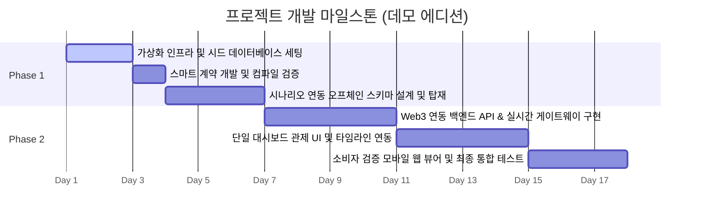

# Development Roadmap: Tuna Cold Chain Ledger (Slim Demo Edition)

본 프로젝트는 참치의 초저온 유통 온도 모니터링 및 블록체인 기반의 위·변조 검증 시스템을 한눈에 확인할 수 있는 **포트폴리오 데모용 종합 관제 대시보드**입니다. 
지나치게 무거운 백엔드 모듈(결재 승인 프로세스, 다중 RBAC 계정 관리 등)을 배제하고, 기획된 **3가지 핵심 유통 시나리오(정상 완료, 온도 초과 경고 발생, 라이브 운송)**의 데이터를 기반으로 스마트 계약과의 실시간 무결성 대조 검증을 명확히 증명하는 데 초점을 맞춥니다.

---

## Milestones & Timeline

---

## Step-by-Step Implementation Details

### Phase 1: 로컬 개발 환경 및 스마트 계약 (완료)

#### **Step 1: 가상화 인프라 환경 구축 및 시나리오 데이터 시딩 (진행 중)**
- **목표:** 개발자 및 외부 평가자가 프로젝트를 켜자마자 고품질 데이터를 볼 수 있도록 데이터베이스 인프라를 완성하고 시드 데이터를 주입합니다.
- **주요 작업:**
  - PostgreSQL, MongoDB, Redis 컨테이너를 로컬 루프백(`127.0.0.1`) 주소로 제한하여 보안 강화 기동.
  - **시나리오 시드 스크립트 작성:** 정상 완료 건(A), 온도 이탈 위험 감지 건(B), 라이브 운송 건(C)의 샘플 발주와 마스터 정보를 데이터베이스에 사전 영속화.

#### **Step 2: Solidity 스마트 계약 개발 및 컴파일**
- **목표:** 유통 체크포인트 마일스톤 도달 시, 무결성 입증용 해시 값을 로컬 블록체인에 영구 기록하는 스마트 계약을 구현합니다.
- **주요 작업:**
  - `LogReceipt` 구조체 정의 (`bytes32 dataHash`, `uint256 timestamp`, `string stepName`).
  - 고유 체크포인트 ID별 불변 기록(`registerCheckpoint`) 및 검증 조회(`verifyCheckpoint`) 함수 완성.
  - Hardhat을 통한 컴파일 및 타입 바인딩(`typechain-types`) 자동 생성 완료.

---

### Phase 2: 온체인 연동 API 및 실시간 모니터링 (다음 구현 단계)

#### **Step 3: 오프체인 데이터베이스 스키마 설계 및 탑재**
- **목표:** 시나리오 데이터를 저장하고, 온체인 기록을 보강하기 위한 DB 엔티티 및 스키마를 구성합니다.
- **주요 작업:**
  - **PostgreSQL (TypeORM):** `Product`, `PurchaseOrder`, `AuditLog` 엔티티 매핑 및 마이그레이션.
  - **MongoDB (Mongoose):** 고주기 센서 시계열 온도/위치 로그 스키마 구성.

#### **Step 4: Web3 연동 백엔드 API 및 실시간 웹소켓 게이트웨이 구현**
- **목표:** DB의 데이터 해시를 추출하여 로컬 이더리움 노드로 트랜잭션을 발행하고, 실시간 온도 이상 상태를 프론트엔드로 전송하는 API 파이프라인을 구축합니다.
- **주요 작업:**
  - NestJS와 Ethers.js 연동: 백엔드 서버 기동 시 배포된 스마트 계약을 인스턴스화하고 트랜잭션 서명 지갑 매핑.
  - Socket.io 기반 실시간 알림 게이트웨이를 열어 라이브 운송 건(시나리오 C)의 실시간 상태 변화 및 임계 온도 이탈 감지 전송.

#### **Step 5: 단일 종합 관제 대시보드 UI 및 타임라인 연동**
- **목표:** 운영자가 복잡한 페이지 이동 없이, 단일 와이드 뷰 화면에서 모든 이력과 검증 상태를 직관적으로 제어할 수 있는 관제 센터를 제작합니다.
- **주요 작업:**
  - 좌측 패널: 시나리오 A, B, C 발주 목록을 기본 표기하고 선택(클릭) 제어 구현.
  - 중앙 패널: 선택된 발주의 경로 지도 및 Recharts 기반 온도 그래프 렌더링.
  - 우측 패널: 어획 ➜ 가공 ➜ 배송 ➜ 입고의 4대 체크포인트 타임라인 및 실시간 블록체인 무결성 검증 배지 노출.

#### **Step 6: 소비자 무결성 검증 모바일 웹 뷰어 구현 및 통합 시나리오 테스트** [COMPLETED]
- **목표:** 소비자가 매장에서 직접 참치의 QR 코드를 조회하여 블록체인 기반 정품 인증을 검증하는 흐름을 완벽히 구현합니다.
- **주요 작업:**
  - 모바일 최적화 퍼블릭 검증 페이지(`ConsumerVerify.tsx`) 구현.
  - 백엔드를 거쳐 블록체인에서 직접 해시를 대조해 "안전 확인 씰" 애니메이션을 제공.
  - 통합 시연 시나리오 수행 및 최적화 마감.

#### **Step 7: 온체인 감사 원장 탐색기(`BlockchainLedger.tsx`) 및 시스템 확장** [COMPLETED]
- **목표:** 이더리움 스마트 계약에 등록된 체크포인트(어획, 가공, 배송, 입고)의 트랜잭션과 데이터 해시를 Etherscan 스타일로 전수 탐색할 수 있는 온체인 감사 원장 페이지를 구축합니다.
- **주요 작업:**
  - 사이드바 메뉴 확장 및 라우팅 추가 (`/blockchain-ledger`).
  - 온체인 트랜잭션, Keccak256 데이터 해시, 블록 번호, 상태 필터링 및 시각적 탐색기 UI 구현.
  - 온체인 원장 상세 모달 및 스마트 계약 검증 결과 뷰어 연동.

